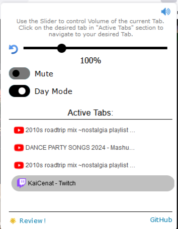
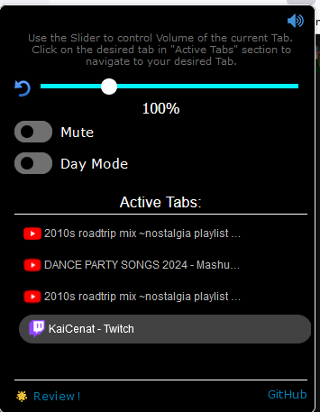

### Description
A browser extension designed to enhance your audio experience, allows you to increase your browser's volume beyond the default 100% and take it up to 400%. Additionally provides a clear view of all active audio tabs, enabling seamless switching between them with a single click. As an open-source tool, Volume Mixxer offers both advanced functionality and transparency for users seeking greater control over their audio settings and privacy over the usage of their data.

## Volume Mixxer Light Theme

## Volume Mixxer Dark Theme
