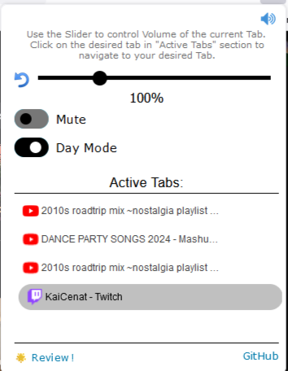
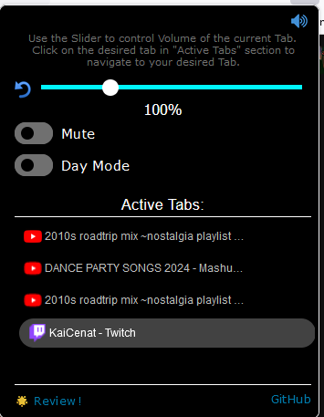

### Description

A browser extension designed to enhance your audio experience, allows you to increase your browser's volume beyond the default 100% and take it up to 400%. Additionally provides a clear view of all active audio tabs, enabling seamless switching between them with a single click. As an open-source tool, Volume Mixxer offers both advanced functionality and transparency for users seeking greater control over their audio settings and privacy over the usage of their data.

## Volume Mixxer Light Theme



## Volume Mixxer Dark Theme



## Development

### Building the Extension

The extension is written in TypeScript and must be compiled before use:

```bash
npm run build
```

### Build Process

The build script performs two steps:

1. **TypeScript Compilation**: `tsc` compiles all `.ts` files from `src/` to JavaScript in `dist/`
2. **Export Removal**: A post-build script removes `export {};` statements from the compiled files

**Why remove `export {}`?**

When TypeScript files use `import type` statements for type safety, TypeScript treats them as ES modules and adds `export {};` at the end of compiled files. However, Firefox extension scripts like background, content scripts and popup must be **regular scripts**, not ES modules. The `export` keyword causes syntax errors in this context.

The post-build script strips these problematic exports, which enables the keeping of TypeScript type safety while generating compatible extension code.

### Development Mode

For active development with auto-rebuild on file changes:

```bash
npm run build:watch
```

Note: The watch mode only runs `tsc -w` and doesn't apply the export removal. You'll need to run `npm run build` for a production build.
